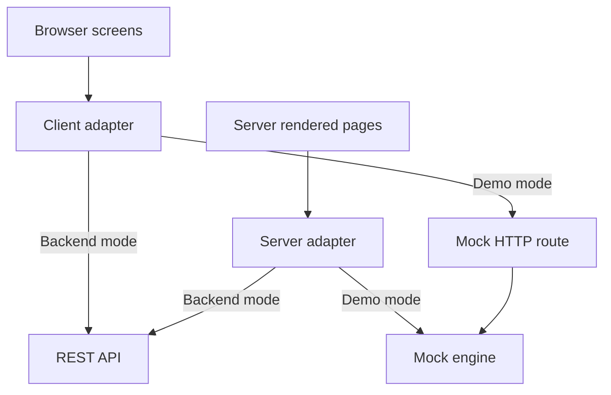

# Variety Groceries — API Contracts

**Audience:** the engineering team implementing the production NestJS backend and the future React Native clients.
**Status:** the web frontend already speaks this contract through the adapter boundary described below; the REST rendering under `/api/v1` is the proposed production surface, fully specified in [`docs/openapi.yaml`](openapi.yaml).

---

## 1. The shared service boundary

Every screen — storefront, account, staff back office, POS, dispatch and rider — obtains business data through **one explicit service interface**. No page imports the mock store; the mock is an implementation detail of the development adapter.



### Files that form the boundary

| File | Role |
| --- | --- |
| `src/services/contracts/` | Shared request/response types, canonical error codes, pagination, idempotency and cache-tag primitives, zod validation schemas. **No Next.js/React/Prisma/mock imports** — portable to backend and native. |
| `src/services/adapters/types.ts` | The `ServiceAdapter` interface + `ApiError` (transport-agnostic). |
| `src/services/adapters/http.ts` | Production HTTP adapter: configurable base URL, `Idempotency-Key` header, request validation, envelope + RFC 7807 problem+json handling, 20s timeout. |
| `src/services/adapters/mock.ts` | **Development-only** in-process mock adapter (loud warning if used by a production bundle without a backend). |
| `src/services/adapters/browser.ts` | Client-component resolution (`NEXT_PUBLIC_API_BASE_URL` → API, else dev mock route) + cache-tag invalidation. |
| `src/services/adapters/server.ts` | Server-component resolution (`API_BASE_URL` → API, else dev mock). |
| `src/services/operation-registry.ts` | Per-operation metadata: read cache tags + mutation invalidation families. Covers all 92 operations (checked by CI). |
| `src/services/client.ts` | Browser-side typed operation surface (`apiOps`) — re-exports contract types. |
| `src/services/server-data.ts` | RSC-side adapter calls for server-rendered pages. |
| `src/services/views.ts` | Compatibility shim re-exporting contract view types. |

### Swapping to the production backend

```bash
# Browser/client components:
NEXT_PUBLIC_API_BASE_URL=https://api.varietygrocery.com/api/v1
# Server components (required with the browser URL):
API_BASE_URL=https://api.varietygrocery.com/api/v1
API_SERVICE_TOKEN=<server-to-server token>
```

The transport selects the documented REST mapping when both URLs are configured. Partial configuration fails with `CONFIGURATION_ERROR`, and `/api/mock/v1` returns 404 in backend mode. With neither URL set, the application remains the demonstrable prototype. Real identity, permissions, persistence and provider integrations require backend implementation.

---

## 2. Conventions

### 2.1 Money, quantities, identifiers, timestamps

- **Money** is always an **integer number of GHS minor units (pesewas)**: `2700` = ₵27.00. Floats are forbidden anywhere money is authoritative. Display strings (`totalLabel`) are convenience fields; the raw integer is the contract.
- **Quantities** are **decimal strings** (`"1"`, `"1.5"`, max 3 fractional digits). Piece-counted SKUs use integers. Stock authority is never a float.
- **IDs** are stable prefixed strings (`prd_`, `var_`, `ord_`, `ret_`, `job_`, `lot_`).
- **Timestamps** are UTC ISO-8601; `*Label` fields carry pre-formatted local display.

### 2.2 Envelope (development protocol)

The mock protocol wraps every response:

```json
{ "ok": true,  "data": { … } }
{ "ok": false, "error": { "code": "OUT_OF_STOCK", "message": "…", "details": { … } } }
```

The production REST API may return bare resources on 2xx and RFC 7807 `application/problem+json` on errors; **both adapters already normalise these into the same `ApiError(code, message, details)`**. Screens branch on `code`, never on HTTP status.

### 2.3 Error codes → HTTP statuses

| Code | HTTP | Meaning / screen behaviour |
| --- | --- | --- |
| `VALIDATION_FAILED` | 400 | Malformed/semantic input rejected before mutation. |
| `INVALID_INPUT` | 400 | Missing required field. |
| `NOT_FOUND` | 404 | Unknown resource id/slug. |
| `UNAUTHENTICATED` | 401 | Missing/expired credentials (production auth). |
| `FORBIDDEN` | 403 | Role or ownership check failed. |
| `CONFLICT` | 409 | Stale state (price changed, transition not allowed). |
| `OUT_OF_STOCK` | 409 | Availability invariant failed; show conflict lines. |
| `RESERVATION_LOST` | 409 | Hold expired/released before stock handover. |
| `IDEMPOTENCY_CONFLICT` | 409 | Same key, different payload; nothing applied. |
| `RULE_VIOLATION` | 422 | Business rule refused (e.g. refund over balance). |
| `BAD_RESPONSE` / `NETWORK` | 502 / 503 | Adapter-level transport failures. |
| `INTERNAL` | 500 | Unexpected fault. |

### 2.4 Pagination, filtering, sorting

List operations accept `page` (1-based, default 1) and `perPage` (server-clamped; default 12–48 by resource) and return `{ items, total, page, pages, perPage }`. Filtering uses resource-specific query parameters (`q`, `category`, `channel`, `status`, `payment`, `filter`); sorting accepts named enums (`popular`, `price_asc`, `price_desc`, `name`, `newest`). Zod schemas live in `contracts/validation.ts` (`pagedSchema`).

### 2.5 Idempotency

Operations that may be retried accept a client-generated idempotency key:

- **Mock protocol today:** `idempotencyKey` body field (checkout complete, POS complete) — engines persist scoped idempotency records.
- **REST protocol:** `Idempotency-Key` request header (the HTTP adapter forwards it automatically when a caller passes one).

Replay guarantees below are enforced for mock checkout/POS. The production backend must implement durable replay for every operation it declares retryable; forwarding a header alone does not establish that guarantee.

1. Same key + same payload → **replays the original result**; no second side effect.
2. Same key + different payload → `409 IDEMPOTENCY_CONFLICT`; nothing applied.
3. New key → normal execution.

### 2.6 Cache refresh after stock/order/payment/return changes

`src/services/operation-registry.ts` declares, per operation, which resource families a successful mutation invalidates: `catalog`, `stock`, `orders`, `payments`, `returns`, `delivery`, `sessions`, `config`, `ai`. After a successful mutation the browser adapter drops matching cached reads (default GET TTL is 0 = no-store, correct for live stock; raise with `NEXT_PUBLIC_CACHE_TTL_MS`) and dispatches a `vg:cache-invalidated` `CustomEvent`. Screens using the shared `useApiData` hook subscribe and reload; custom loaders need their own refresh handling. Cache keys encode query tuples; generation and per-key request guards prevent invalidated or older reads from restoring stale data. `demo.reset` invalidates everything. Server components render per request (dynamic), so RSC reads are always fresh.

**Example:** after `admin.pos.complete`, cached `catalog`, `stock`, `orders`, `payments` and `sessions` reads are dropped — POS search, inventory overview and the dashboard all refetch.

### 2.7 Validation schemas

`src/services/contracts/validation.ts` holds the zod request schemas for 16 high-impact operations (quantities positive decimal strings, money non-negative integers, payment-method enums, idempotency key length ≥ 8, `min(1)` line arrays, …). They run:

- **client-side** in both adapters before a request is sent (fast feedback),
- **server-side** in the future NestJS backend (authoritative — the backend MUST re-validate; client validation is UX, not security),
- **in CI** via `scripts/contracts-check.ts`, which also validates live responses against the response schemas for the covered operations (32 assertions). This is selected response coverage, not complete runtime response validation for every operation.

---

### 2.8 Return stock history

Every inspection records all credited `{lotId, quantity}` entries in `disposition.stockLots`. The first `lotId` remains for compatibility. Reclassification validates all entries before reversing any credit, retains zeroed historical lots and records compensating movements. Moved/reserved stock or legacy records with incomplete history require reconciliation. Use the earliest known original expiry; production inspection must quarantine unknown perishable provenance.

## 3. Operation surface and REST mapping

**92 mock operations today** (the router's dispatch table) map to the proposed REST endpoints below. The OpenAPI definition (`docs/openapi.yaml`, 92 operations) is normative for shapes; this table is the complete inventory and the migration checklist. The executable mapping is `src/services/contracts/endpoints.ts`. REST paths and methods are explicit; resource IDs are encoded into path parameters, and catalogue search translates `query` to `q`. Demo HTTP calls use an explicitly selected mock protocol. CI checks all 92 mapping rows against OpenAPI and actual HTTP requests.

### 3.1 Catalogue (public, no auth)

| Mock operation | REST endpoint | Notes |
| --- | --- | --- |
| `catalog.categories` | `GET /catalog/categories` | Active categories + purchasable counts. |
| `catalog.list` | `GET /catalog/products` | `q`, `category`, `sort`, `page`, `perPage`. Zero-availability hidden. |
| `catalog.product` | `GET /catalog/products/{slug}` | `purchasable:false` when out of stock (saved links). |
| `catalog.home` | `GET /catalog/home` | Homepage aggregate bundle. |
| `catalog.by-variants` | `POST /catalog/products:by-variants` | Cart resolution. |

### 3.2 Checkout & orders (public)

| Mock operation | REST endpoint | Notes |
| --- | --- | --- |
| `checkout.quote` | `POST /checkout/quote` | Live availability + zone fee + minimum. |
| `checkout.complete` | `POST /checkout/complete` | **Idempotent.** Atomic all-line reservation. |
| `checkout.payment-outcome` | `POST /orders/{orderId}/payment-outcome` | Provider callback; duplicate-safe. |
| `checkout.status` | `GET /orders/{orderId}` | Customer-safe projection. |
| `orders.detail` | `GET /orders/{orderId}` | Same projection (staff auth in production). |
| `orders.track` | `POST /orders/track` | Reference + verification code. |
| `checkout.zones` | `GET /checkout/zones` | |
| `checkout.slots` | `GET /checkout/zones/{zoneId}/slots` | |

### 3.3 Account (customer auth in production)

| Mock operation | REST endpoint | Notes |
| --- | --- | --- |
| `account.summary` | `GET /account/summary` | |
| `account.orders` | `GET /account/orders` | |
| `account.cancel` | `POST /account/orders/{orderId}/cancel` | Paid orders get a linked executable refund. |
| `account.return-lines` | `POST /account/orders/{orderId}/return-lines` | Semantically a read; POST keeps mock body transport. |
| `account.create-return` | `POST /account/returns` | **Idempotent.** Duplicate-line aggregation enforced. |
| `account.returns` | `GET /account/returns` | |
| `returns.detail` | `GET /returns/{returnId}` | Shared by account + staff. |

### 3.4 AI (public/staff; deterministic demo)

| Mock operation | REST endpoint | Notes |
| --- | --- | --- |
| `ai.assistant` | `POST /ai/assistant` | Grounded, evidence-bearing. |
| `ai.budget-basket` | `POST /ai/budget-basket` | |
| `admin.ai.suggestions` | `GET /admin/ai/suggestions` | Reviewable suggestions. |
| `admin.ai.generate` | `POST /admin/ai/generate` | |
| `admin.ai.review` | `POST /admin/ai/review` | |
| `admin.ai.business-question` | `POST /admin/ai/business-question` | |

### 3.5 Staff: dashboard, orders, fulfilment

| Mock operation | REST endpoint | Notes |
| --- | --- | --- |
| `admin.dashboard` | `GET /admin/dashboard` | |
| `admin.orders` | `GET /admin/orders` | Filters `channel/status/payment/q`. |
| `admin.order` | `GET /admin/orders/{orderId}` | + internal reservations/notes/refunds. |
| `admin.order.action` | `POST /admin/orders/{orderId}/actions` | **Idempotent.** State machines + review resolution. |
| `admin.fulfilment` | `GET /admin/fulfilment` | FEFO lot allocations exposed. |

### 3.6 Staff: POS & cashier sessions

| Mock operation | REST endpoint | Notes |
| --- | --- | --- |
| `admin.pos.search` | `GET /pos/search` | |
| `admin.pos.complete` | `POST /pos/complete` | **Idempotent.** Positive quantities enforced. |
| `admin.pos.hold` | `POST /pos/holds` | Draft with expiry. |
| `admin.pos.drafts` | `GET /pos/drafts` | By session. |
| `admin.pos.resume` | `POST /pos/drafts/{draftId}/resume` | |
| `admin.pos.release-draft` | `POST /pos/drafts/{draftId}/release` | |
| `admin.pos.receipt-lookup` | `GET /pos/receipts/{receiptNo}` | With returnable lines. |
| `admin.sessions` | `GET /sessions` | |
| `admin.sessions.open` | `POST /sessions/open` | |
| `admin.sessions.movement` | `POST /sessions/{sessionId}/movements` | |
| `admin.sessions.close` | `POST /sessions/{sessionId}/close` | Expected vs counted difference. |

### 3.7 Staff: inventory

| Mock operation | REST endpoint | Notes |
| --- | --- | --- |
| `admin.inventory.overview` | `GET /inventory/overview` | Physical/reserved/available per variant. |
| `admin.inventory.lots` | `GET /inventory/lots` | By variant. |
| `admin.inventory.lot.quarantine` | `POST /inventory/lots/{lotId}/quarantine` | |
| `admin.inventory.lot.dispose` | `POST /inventory/lots/{lotId}/dispose` | |
| `admin.inventory.receipts` | `GET /inventory/receipts` | |
| `admin.inventory.receive` | `POST /inventory/receive` | PO-matching, lot creation. |
| `admin.inventory.adjustments` | `GET /inventory/adjustments` | |
| `admin.inventory.adjustments.create` | `POST /inventory/adjustments/create` | Approval-gated. |
| `admin.inventory.adjustments.decide` | `POST /inventory/adjustments/decide` | |
| `admin.inventory.stocktakes` | `GET /inventory/stocktakes` | |
| `admin.inventory.stocktakes.open` | `POST /inventory/stocktakes/open` | |
| `admin.inventory.stocktakes.count` | `POST /inventory/stocktakes/count` | |
| `admin.inventory.stocktakes.close` | `POST /inventory/stocktakes/close` | Optional corrections. |
| `admin.inventory.expiry` | `GET /inventory/expiry` | Buckets + daysLeft. |

### 3.8 Staff: catalogue, suppliers, purchasing

| Mock operation | REST endpoint | Notes |
| --- | --- | --- |
| `admin.products` | `GET /admin/products` | |
| `admin.product` | `GET /admin/products/{productId}` | Variants, lots, movements. |
| `admin.product.update` | `POST /admin/products/update` | Audited. |
| `admin.variant.update` | `POST /admin/variants/update` | Price changes audited with before/after. |
| `admin.categories` | `GET /admin/categories` | |
| `admin.categories.update` | `POST /admin/categories/update` | |
| `admin.suppliers` | `GET /admin/suppliers` | |
| `admin.purchases` | `GET /admin/purchases` | |
| `admin.purchases.create` | `POST /admin/purchases/create` | |
| `admin.purchases.send` | `POST /admin/purchases/send` | |

### 3.9 Staff: dispatch, riders, providers

| Mock operation | REST endpoint | Notes |
| --- | --- | --- |
| `admin.dispatch.queue` | `GET /dispatch/queue` | Ready + jobs + riders + providers. |
| `admin.dispatch.assign` | `POST /dispatch/assign` | Rider/provider/manual. |
| `admin.dispatch.job.action` | `POST /dispatch/jobs/{jobId}/actions` | Reschedule / return / remit. |
| `admin.riders` | `GET /riders` | |
| `admin.riders.toggle` | `POST /riders/{riderId}/availability` | |
| `admin.providers` | `GET /providers` | |

### 3.10 Staff: returns, refunds, payments, customers

| Mock operation | REST endpoint | Notes |
| --- | --- | --- |
| `admin.returns` | `GET /admin/returns` | Rows carry `refundableMinor`. |
| `admin.return.action` | `POST /returns/{returnId}/actions` | Once-only dispositions. |
| `admin.refunds` | `GET /refunds` | |
| `admin.refund.action` | `POST /refunds/{refundId}/actions` | Approve/execute/retry; balance revalidation. |
| `admin.payments` | `GET /payments` | Settlement states. |
| `admin.customers` | `GET /admin/customers` | |
| `admin.customer` | `GET /admin/customers/{customerId}` | |

### 3.11 Staff: reports, team, audit, settings; rider; demo

| Mock operation | REST endpoint | Notes |
| --- | --- | --- |
| `admin.reports` | `GET /admin/reports` | CSV export derives from the same records. |
| `admin.team` | `GET /admin/team` | Role matrix in `docs/PERMISSIONS.md`. |
| `admin.audit` | `GET /admin/audit` | `q` filter. |
| `admin.settings` | `GET /admin/settings` | |
| `admin.settings.update` | `POST /admin/settings/update` | |
| `rider.login` | `GET /rider/login` | Demo picker; production = phone + PIN/OAuth. |
| `rider.jobs` | `GET /rider/jobs` | Today + self + remittance. |
| `rider.job` | `GET /rider/jobs/{jobId}` | |
| `rider.action` | `POST /rider/jobs/{jobId}/actions` | **Idempotent.** Proof + COD separation. |
| `rider.history` | `GET /rider/history` | |
| `demo.reset` | `POST /demo/reset` | **Development only.** |
| `demo.flags` | `POST /demo/flags` | Development only. |
| `demo.scenario` | `POST /demo/scenario` | Development only. |

---

## 4. Authentication, permissions, ownership

Today the prototype is unauthenticated (honest boundary; see `docs/KNOWN_ISSUES.md`). The contract reserves:

- `bearerAuth` (JWT access tokens) on the OpenAPI security scheme; native clients supply bearer credentials through a secure session adapter. Web HTTP uses `credentials: include` for planned secure HttpOnly sessions, with backend origin/CSRF checks and credentialed CORS where needed. No web bearer credential is read from localStorage. The server adapter can attach `API_SERVICE_TOKEN`; authentication itself is not implemented by this handoff.
- `UNAUTHENTICATED` (401) and `FORBIDDEN` (403) error codes with defined screen behaviour (re-auth prompt vs. permission notice).
- The **35-permission / 8-role matrix** in `docs/PERMISSIONS.md` is the authorisation model the backend must enforce per operation; customer and rider endpoints additionally enforce **resource ownership** (`customerId`, `riderId` must match the session principal).
- Refresh, revocation, device sessions: see `docs/MOBILE_READINESS.md`.

## 5. Concurrency, retries, safety

- **Reservations are all-or-nothing and shared** by online checkout and POS. Final-unit conflicts surface as `OUT_OF_STOCK` with per-line detail, never partial holds.
- **Stock handover** (`consume`) revalidates reservation coverage and physical lot quantities inside the operation; failures return `RESERVATION_LOST` / `OUT_OF_STOCK` and mutate nothing.
- **Provider callbacks are idempotent** — duplicate events are acknowledged, never double-applied; late successes route to review.
- **Refunds revalidate balances** at execution: per-return refundable amount and order-level paid amount, accounting for completed refunds and unresolved commitments.
- Client retry policy: retry automatically only when the backend implements durable key replay for that operation; other mutations should be user-initiated (buttons) rather than auto-retried. Transport failures raise `NETWORK`. The server may already have committed a mutation before its response was lost; retain the original key and reconcile the outcome before presenting success or resubmitting.

## 6. Versioning & compatibility

- The mock protocol is versioned by URL (`/api/mock/v1/…`); the production API is `/api/v1/…`. Breaking changes ship as `/api/v2` — additive fields only inside a version.
- Older installed app versions must keep working: responses only gain optional fields; deprecated fields are retained for at least two mobile release cycles (`docs/MOBILE_READINESS.md`).
- The shared contracts package is the compatibility surface: both web and native pin their copy in lockstep via the future workspace (`docs/BACKEND_ARCHITECTURE.md` §Workspace).

## 7. React Native consumption

`src/services/contracts/` + `src/types/domain.ts` are framework-free (pure TS + zod). The Expo apps copy (or later, workspace-reference) these files verbatim, implement a `ServiceAdapter` against the same base URL with the same `Idempotency-Key`/error/normalisation rules, and reuse the zod schemas for request validation and response parsing. Offline queueing and pending-upload semantics are specified in `docs/MOBILE_READINESS.md`.

## 8. Keeping the contract honest

| Check | Command | What it proves |
| --- | --- | --- |
| Contracts suite | `bun scripts/contracts-check.ts` | Request schemas reject malformed input; response schemas match the live service; registry covers all 92 operations; adapters agree. |
| Acceptance suite | `bash scripts/acceptance-checks.sh` | 24 business rules over HTTP (transport/HTTP/JSON failures abort — no false passes). |
| Handoff regressions | `bun scripts/handoff-regressions.ts` | The 7 audited defects + admin.returns contract stay fixed. |
| Type check | `npx tsc --noEmit` | Screen ↔ contract typing with no suppression. |
| CI | `.github/workflows/ci.yml` | lint + tsc + build + all five suites on every push. |

## Implemented backend foundation (10 October 2026)

The contract source is now `packages/contracts/src`; prior web paths re-export
it. `apps/api` implements the limited surface in `BACKEND_FOUNDATION.md`, with
`openapi-foundation.json` generated from that application. The mapping above
remains the full 92-operation target and must not be read as 92 implemented
backend endpoints. Identity supplies web cookie/CSRF and native rotating token
contracts; inventory receiving requires durable replay keys and derives actor
permissions from the session. Public frontend activation awaits commerce parity.
